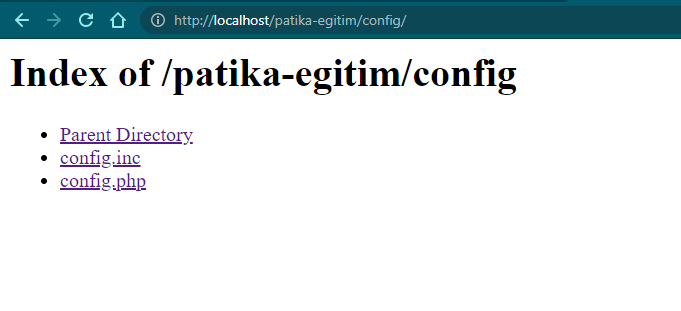
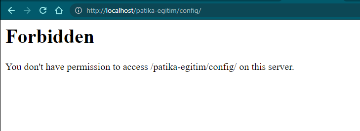
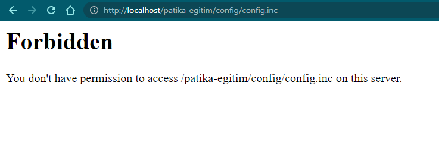
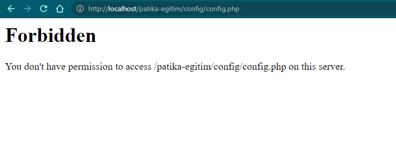
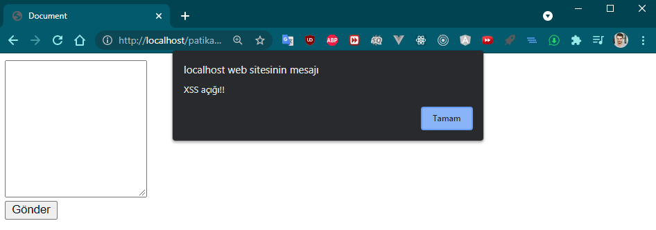
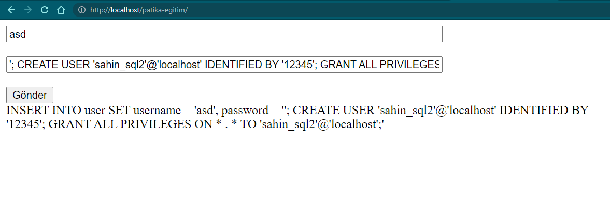

## Güvenlik

### Dosya ve Dizin Güvenliği

- Dosya uzantısı .php olmayan dosyalara dışardan erişimi kapatmazsak içerikleri okunabilir.


Problem işte tam olarak burada!


Peki dizine erişmek istediğimizde karşımıza nasıl bir sorun çıkıyor?

*Artık burada varsa bir açık geçmiş ola :)*



Şimdi bu hatanın da önüne geçelim. Bu noktada imdadımıza ``.htaccess`` koşuyor.

```Options -Indexes``` 

VEEE İŞTE SONUÇ!



Ama hala inc uzantılı dosyamıza erişilebilir.


```.htaccess``` dosyama ``deny from all`` komutunu vererek artık bu dosyaların çalıştırılmamasını sağlayabiliriz.





Dosyalarımız artık sadece dahil edildikleri yerde çalışacaklar.


### XSS Cross Site Scripting

XSS (Cross Site Scripting) script kodları üzerinden (genelde javascript) bir web sayfasına saldırı yapılmasıdır.

XSS çoğunlukla tarayıcıda saklanan bilgiler olan cookielere saldırı amacı ile kullanılmaktadır.





*Çözüm* htmlspecialchars


Aynı zamanda cookie güvenliği için ``Http Only`` cookieler oluşturabilirsiniz.

```
setcookie('test_cookie', 'selamlar', time() + 86400, '/', 'localhost', null, true);
```


### SQL Injection

```
<form action="" method="post">
    <input style="width: 70%" type="text" name="username" value="<?= @$_POST['username'] ?>"><br><br>
    <input style="width: 70%" type="text" name="password" value="<?= @$_POST['password'] ?>"><br><br>
    <input type="submit" name="login" value="Gönder">
</form>
<?php
if (isset($_POST['login'])){

    $db = new PDO("mysql:host=localhost;dbname=testdb;", 'root','root');

    $sql = "INSERT INTO user SET username = '{$_POST['username']}', password = '{$_POST['password']}'";

    echo $sql;
    $add = $db->query($sql);


}
?>
```

```
'; CREATE USER 'sahin_sql2'@'localhost' IDENTIFIED BY '12345'; 

    GRANT ALL PRIVILEGES ON * . * TO 'sahin_sql2'@'localhost';
```



